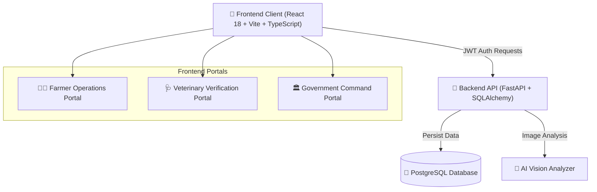

# 🛡️ AgriSentinel — Digital Farm Biosecurity & Disease Surveillance System


[](https://python.org)
[](https://fastapi.tiangolo.com)
[](https://react.dev)
[](https://typescriptlang.org)
[](https://postgresql.org)
[](https://vercel.com)
[](https://render.com)

> **AgriSentinel** is an enterprise-grade digital biosecurity, disease surveillance, and farm health compliance ecosystem built for livestock producers, veterinary officers, and government agricultural health agencies across India.

---

## 🌟 Key Platform Features

| Module | Features & Capabilities |
| :--- | :--- |
| 👨‍🌾 **Farmer Operations** | Real-time biosecurity scoring, digital passports, continuous disease monitoring checklist, multi-farm switching (14 farms across 5 states), veterinary selection modal. |
| 🩺 **Veterinary Verification** | Real database account assignment, incident evidence inspection, action plan generator, evidence approval/rejection with telemetry tracking. |
| 🏛️ **Government Field Command** | High-level risk heatmaps, district-wide statistics, inspection priority matrix, **Account Management with non-destructive account deactivation** (`is_active = False`). |
| 🌐 **6-Language Multilingual UI** | Instant seamless translation for **English**, **Hindi (हिंदी)**, **Kannada (ಕನ್ನಡ)**, **Malayalam (മലയാളം)**, **Tamil (தமிழ்)**, and **Telugu (తెలుగు)**. |
| 🔒 **Role-Based Security & Auth** | Server-enforced JWT tokens, role selection before login, persistent unique official IDs (`FAR-0001`, `VET-0001`, `OFF-0001`). |
| 🛡️ **Data Preservation Integrity** | Non-destructive account deletion protects 100% of historical farms, incidents, evidence, inspections, and risk telemetry records. |

---

## 🏛️ System Architecture



---

## 🌐 14 Registered Multi-State Demo Farms

| # | Farm ID | Farm Name | State / Location | Type | Risk Level |
|:---|:---|:---|:---|:---|:---|
| 1 | `FARM-JH-2026-0487` | **GreenValley Bio-Farm #04** | Ranchi, Jharkhand | Poultry | 🟢 Safe (78%) |
| 2 | `FARM-JH-2026-0102` | **Apex Swine Breeding Center** | Ramgarh, Jharkhand | Pig | 🔴 Critical (42%) |
| 3 | `FARM-JH-2026-0319` | **Highland Dairy & Livestock Hub** | Ormanjhi, Ranchi | Mixed | 🟢 Safe (85%) |
| 4 | `FARM-JH-2026-0550` | **Chota Nagpur Agro-Livestock Farm** | Mandu, Ramgarh | Poultry | 🟢 Safe (64%) |
| 5 | `FARM-KA-2026-0601` | **Nandi Hills Poultry Farm** | Devanahalli, Karnataka | Poultry | 🟢 Safe (81%) |
| 6 | `FARM-KA-2026-0602` | **Mysuru Heritage Pig Farm** | T. Narasipura, Karnataka | Pig | 🟡 Caution (55%) |
| 7 | `FARM-KA-2026-0603` | **Belagavi Organic Poultry Cooperative** | Khanapur, Karnataka | Poultry | 🟢 Safe (72%) |
| 8 | `FARM-AP-2026-0701` | **Guntur Broiler Excellence Farm** | Tenali, Andhra Pradesh | Poultry | 🟡 Caution (68%) |
| 9 | `FARM-AP-2026-0702` | **Krishna Delta Swine Farm** | Machilipatnam, AP | Pig | 🔴 Critical (38%) |
| 10 | `FARM-AP-2026-0703` | **Chittoor Hills Poultry Estate** | Madanapalle, AP | Poultry | 🟢 Safe (76%) |
| 11 | `FARM-TN-2026-0801` | **Namakkal Layer Poultry Complex** | Namakkal, Tamil Nadu | Poultry | 🟢 Safe (83%) |
| 12 | `FARM-TN-2026-0802` | **Coimbatore Hill Pig Farm** | Mettupalayam, Tamil Nadu | Pig | 🟡 Caution (60%) |
| 13 | `FARM-KL-2026-0901` | **Thrissur Backwater Pig Farm** | Kodungallur, Kerala | Pig | 🔴 Critical (47%) |
| 14 | `FARM-KL-2026-0902` | **Ernakulam Poultry Farm** | Angamaly, Kerala | Poultry | 🟢 Safe (74%) |

---

## 🛠️ Local Development Setup

### 1. Frontend Setup (React + Vite)

```bash
# Install dependencies
npm install

# Start Vite dev server
npm run dev
```

### 2. Backend Setup (FastAPI + Python)

```bash
cd backend

# Create virtual environment
python -m venv .venv
source .venv/bin/activate  # On Windows: .venv\Scripts\activate

# Install Python requirements
pip install -r requirements.txt

# Run database migrations
alembic upgrade head

# Seed initial database
python scripts/seed.py

# Start uvicorn server
uvicorn app.main:app --reload --port 8000
```

---

## 🧪 Testing & Quality Assurance

Run the automated backend test suites to verify RBAC security and account deactivation rules:

```bash
# Test Auth & Role-Based Access Control
python backend/scripts/test_auth_rbac.py

# Test Account Creation, Vet Selection & Non-Destructive Deactivation
python backend/scripts/test_accounts_deactivation.py
```

---

## 📜 License

Distributed under the MIT License. See `LICENSE` for more information.